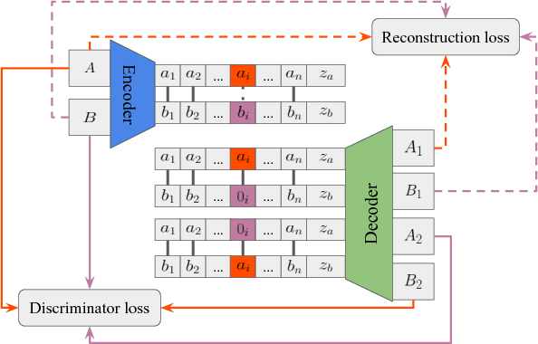
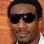
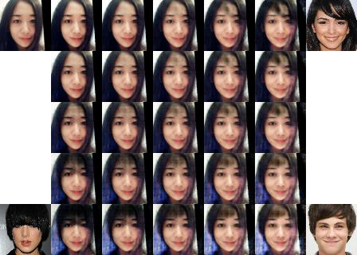
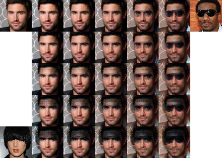

# DNA-GAN: Learning Disentangled Representations from Multi-Attribute Images

By Taihong Xiao, Jiapeng Hong and Jinwen Ma

### Introduction

This repo is the official TensorFlow implementation for our paper DNA-GAN: Learning Disentangled Representations from
Multi-Attribute Images ([OpenReview](https://openreview.net/pdf?id=Syr8Qc1CW), [ArXiv](https://arxiv.org/abs/1711.05415)).
DNA-GAN is a supervised method for disentangling multiple factors of variation simultaneously by using
multi-attribute images. It can manipulate several attributes in the latent representations of images,
which is a generalization of [GeneGAN](https://github.com/Prinsphield/GeneGAN). However, DNA-GAN abolishes
the nulling loss and employes a single discriminator for guiding images generation.

<div align="center">

</div>
<br/>

A and B are two images with different label at i-th position. Through an encoder, we can obtain
two DNA pieces (latent representations). By the annihilating the recessive pattern
 and swapping
two pieces, we could obtain another two DNA pieces. Therefore, we could obtain four images through
an decoder. The reconstruction loss is used to ensure the consistency between A1 and A, B1 and B.
The adversarial discriminator loss helps generate novel images A2 and B2.
Through iterative training, DNA-GAN is able to disentangle all factors of variations.

### Requirement

- Python 2.7 or 3.5
- TensorFlow 1.3 or higher
- OpenCV 3.2


### Training DNA-GAN on CelebA Dataset

0. Download [celebA](http://mmlab.ie.cuhk.edu.hk/projects/CelebA.html) dataset and unzip it into
`datasets` directory. There are various source providers for CelebA datasets. To ensure that the
size of downloaded images is correct, please run `identify datasets/celebA/data/000001.jpg`. The
size should be 409 x 687 if you are using the same dataset. Besides, please ensure that you have
the following directory tree structure in your repo.

```
├── datasets
│   └── celebA
│       ├── data
│       ├── list_attr_celeba.txt
│       └── list_landmarks_celeba.txt
```

1. Run `python preprocess.py`. It will take only few minutes to preprocess all images.
A new directory `datasets/celebA/align_5p` will be created.

2. Run `python create_tfrecords.py` to obtain tfrecords files.

3. Run `python train.py -a Bangs Eyeglasses -g 0` to train DNA-GAN with respect to two attributes
`Bangs` and `Eyeglasses` simultaneuously. You can play with other attributes as well. Please refer
to `list_attr_celeba.txt` for all available attributes.

4. Run `tensorboard --logdir=./train_log/logs --port=6006` to watch your training process.


### Manipulating Multiple Attributes

We provided three kinds of mode for your manipulating. Run `python test.py -h` for detailed help.

#### 1. Interpolation on One Attribute

You can also interpolating the process of adding eyeglasses to one person by running

    python test.py -m interpolation -a Bangs Eyeglasses --swap_list 1 -i input_img.jpg -t target_img.jpg -n 5

`--swap_list` gives the indices of attributes to do interpolation.
`-n 5` gives the interpolation length.

<div align="center">


</div>
<div align="center">
Interpolation on Eyeglasses
</div>
<br/>


#### 2. Matrix Interpolation on One Attributes

What if I want to change my hairstyle everyday? No problem.
Take your selfie as input, and several hair models as targets images.

    python test.py -m matrix -a Bangs Eyeglasses --swap_list 0 -i input_img.jpg --targets target_img0.jpg -target_img1.jpg target_img2.jpg target_img3.jpg -s 5 5

Which hairstyle suits you best?

<div align="center">

</div>
<div align="center">
Interpolation on different Bangs
</div>
<br/>


#### 3. Interpolation on Two Attributes

The most amazing thing is that we can interpolating two attributes in the same time.

    python test.py -m interpolation2 -a Bangs Eyeglasses --swap_list 0 1 -i input_img.jpg --targets target_img0.jpg target_img1.jpg -s 5 5

<div align="center">

</div>
<div align="center">
Interpolation on Bangs and Eyeglasses
</div>
<br/>


For more interpolation results, please refer to our [paper](https://openreview.net/pdf?id=Syr8Qc1CW).

